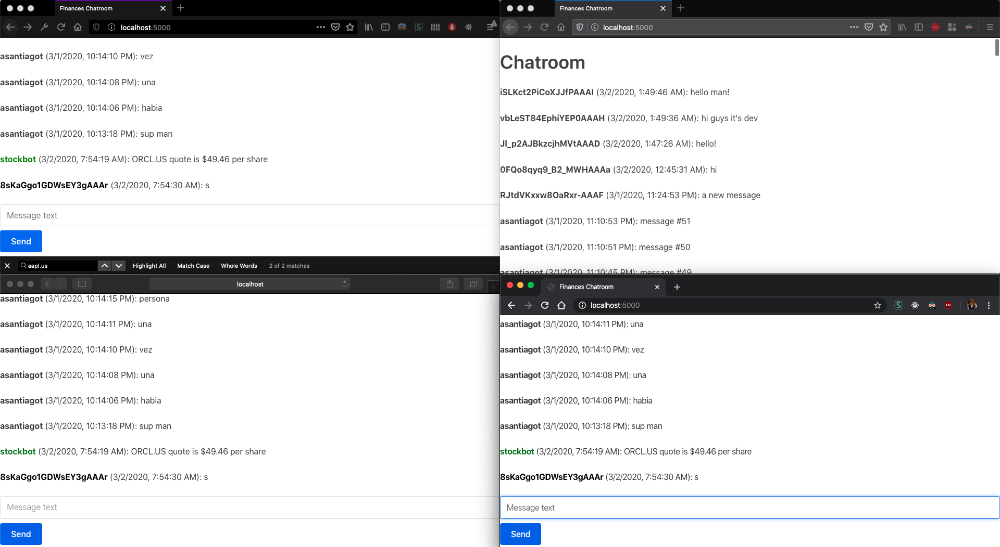

# FINANCES CHATROOM

## Description
Browser-based chatroom built with Node.js. It implements Socket.io as broker, and allows users to chat and request the stock price of a given financial entity. This is done with a decoupled bot that parses the received CSV and returns a message into the chatroom.

## Mandatory features achieved
1. Allow users to post messages as commands with the format /stock=<stock_code
2. Decoupled bot that calls API and parses response as a message into the chatroom
3. Order messages by timestamps, display only last 50

## Pending items
1. Allow user registration (Users schema and DB Operations are ready, just need to implement the routing)

## Instructions
### A. MongoDB Setup
1. Install MongoDB and start an instance
```
docker pull mongo
docker run -d -p 27017-27019:27017-27019 --name mongodb mongo:latest
docker exec -it mongodb bash
mongo
```

2. Verify MongoDB instance is up by running any valid command
``` 
show collections
```

3. Add a couple of messages to load into the chatroom
```
db.messages.insert({username: 'pirateking', message: 'hello friends, this is the first message', date: new Date()});
db.messages.insert({username: 'harrypotter', message: 'how are you?', date: new Date()});
db.messages.insert({username: 'wolf', message: 'stock market is crazy', date: new Date()});
db.messages.insert({username: 'teletubby', message: 'weather is good', date: new Date()});
db.messages.insert({username: 'bruce', message: 'i am batman', date: new Date()});

```

### B. Start Chatroom
From root directory, execute the following commands
```
npm install
npm run start
```

### C. Begin chatting
In your browser, go to http://localhost:5000 and start chatting!
